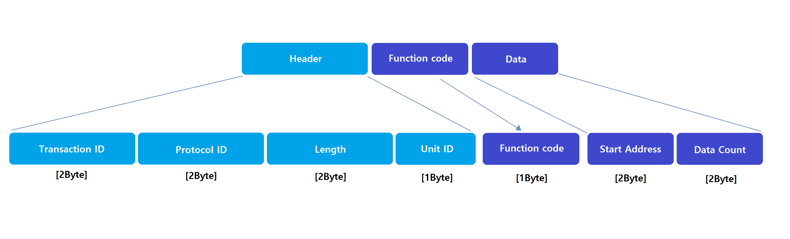
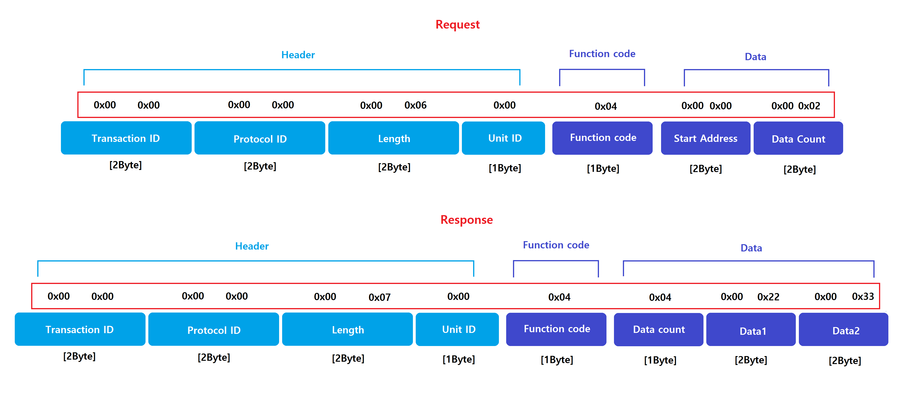

# 장비간 통신 예제

## 기본개념
---
### 통신의 종류
통신 종류는 크게 물리적인 구성에 따라 `Serial통신`과 `TCP/IP통신`으로 나눌 수 있습니다.
 
* Serial 통신  
Serial통신은 통신 `케이블의 물리적인 구성`에 따라 다양한 통신이 존재합니다.  
흔히 PLC장비에서 쓰이는 물리적인 구성은 `RS-485`, `RS-232`, `RS-422` 등이 존재합니다.  
그러나 실제로 많이 쓰이는 물리적인 구성은 `RS-485`, `RS-232`이 있으며 `RS-485`통신을 가장 많이 사용합니다.  
`RS-232`의 경우 같은 케이블 위에서 `1:1`통신이고 통신 거리 또한 짧습니다.  
`RS-485`의 경우 같은 케이블 위에서 `N:N`통신이 가능하고 통신 거리 또한 가장 깁니다.

* TCP/IP 통신  
흔히 인터넷 환경에서 많이 쓰이는 통신이며 http통신도 TCP/IP에 기반하고 있습니다.  
Serial통신에 비해 통신속도가 `굉장히 빠릅니다`.  
`IP`로 장비를 구분하며 `N:N`통신이 가능합니다.

### 프로토콜
장비간에 주어진 환경을 통해 통신하여 데이터를 주고받는데 서로 데이터를 어떻게 주고받을지에 대한 `약속`입니다.  
통신 프로토콜의 종류는 다양하지만 `PLC 장비와의 연동에서 대표적인 통신`방식으로 `MODBUS` 통신이 있습니다.  
`MODBUS` 프로토콜을 사용시 Serial 통신일 때 `MODBUS RTU`와 `MODBUS ASCII` 방식이 있습니다.  
`TCP/IP` 통신일 경우 `MODBUS TCP` 통신이 있습니다.  
이름이 같아 서로 같은 프로토콜이라고 생각 할 수 있지만 `MODBUS RTU/ASCII`, `MODBUS TCP`는 서로 전혀 다른 프로토콜이라고 봐도 무방합니다.

## MODBUS TCP 프로토콜
---
### 구성
구성은 크게 `Header`, `Function code`, `Data`로 나뉜다.
* Header  
`통신에 필요한 기본적인 정보`를 가지고 세부적으로 `Transaction ID`, `Protocol ID`, `Data Length`, `Unit ID`로 나뉜다.
* Function code  
어떤 `데이터 타입`을 `읽기`를 할 건지 `쓰기` 할 건지에 대한 정보를 가진다.
* Data  
실제 읽거나 쓰기 할 `데이터의 정보`를 가지며 세부적으로는 `Start address`와 `Data count` 부분으로 나뉜다.

### 프레임 구조의 역할
* Transaction ID  
요청하는 측에서 최초 `0x0000` 값부터 통신 시작하여 1씩 증가시키며 응답하는 측에서는 그 값을 그대로 복사해서 사용합니다. 통신 시 한 쌍으로 작업이 이루어졌는지를 확인하는 부분이며 `고정 값`으로 사용하여도 통신하는 데는 무리가 없습니다.
* Protocol ID  
프로토콜의 ID를 나타내며 MODBUS-TCP는 `0x0000`의 `고정 값`을 사용합니다.
* Data Length  
Unit ID 이후의 데이터의 길이를 의미하며 단위는 'Byte'입니다. MODBUS TCP 프로토콜의 특성상 `0x0006`으로 `고정 값`을 사용합니다.
* Unit ID  
Serial 통신 시 같은 회선에서 각각의 장비를 구분하기 위한 부분이었으며 TCP/IP통신에서는 사용하지 않는 부분입니다. `적당한 값으로 고정`하여 통신하면 됩니다.
* Function code  
데이터의 `타입`과 `읽기 또는 쓰기`를 결정하는 코드입니다. 코드에 대한 설명은 이어서 설명합니다.
* Start address  
통신의 내용을 실행 할 데이터의 `시작주소`에 대한 위치를 나타냅니다.
* Data count  
시작주소를 기준으로 통신의 내용을 실행 할 `데이터의 갯수`를 나타냅니다.

### Function code
통신 시 데이터의 `크기`에 따라 `Bit`와 `Word(2Byte)`로 나뉘며 데이터의 `유형`에 따라 `입력(Input)`과 `출력(Coil, Register)`로 나뉘고 `명령`에 따라 `읽기`와 `쓰기`로, 쓰기의 경우 `단일 데이터`와 `연속 데이터`로 나뉘어서 총 8개의 코드가 존재한다.
|Type|Name|Code|
|:--:|:--:|:--:|
|Bit|Read Discrete Inputs|0x02|
|Bit|Read Coil|0x01|
|Bit|Write Single Coils|0x05|
|Bit|Write Multiple Coils|0x15|
|Word|Read Input Resgister|0x04|
|Word|Read Hoding Resgisters|0x03|
|Word|Write Single Holding Resgister|0x06|
|Word|Write Multiple Holding Resgister|0x16|

### MODBUS TCP 프로토콜의 예시
0번부터 2개의 데이터를 요청하여 0 ~ 1의 데이터를 요청하였을 때의 응답 프로토콜이다.  
응답 프로토콜의 기본적인 프레임은 요청과 동일하고 Function code는 요청과 동일한 값으로 응답한다.  
크게 다른 점은 데이터부인데 요청 Function code가 Word 단위로 읽기 때문에 실제 데이터의 크기와 각각의 실제 데이터의 값이 들어있다.
